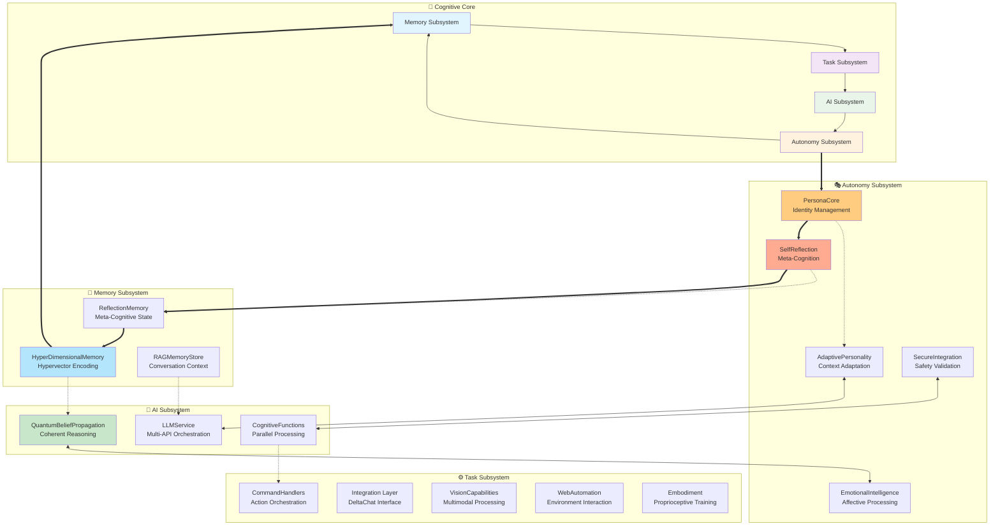
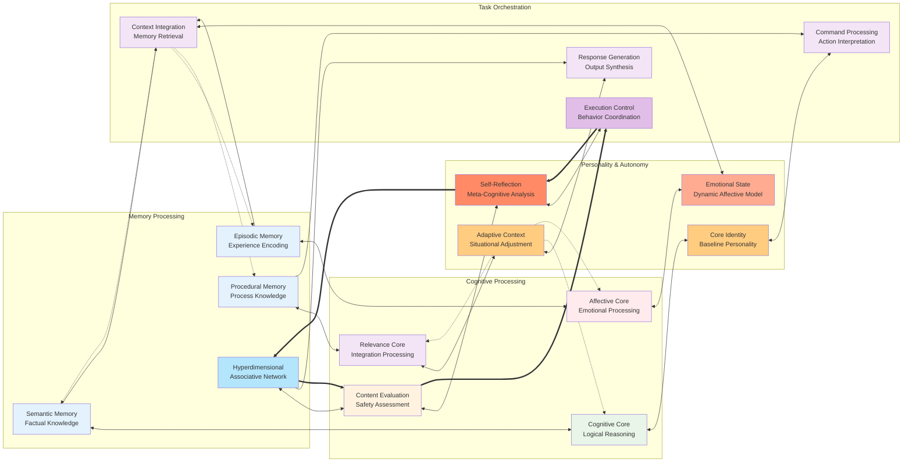
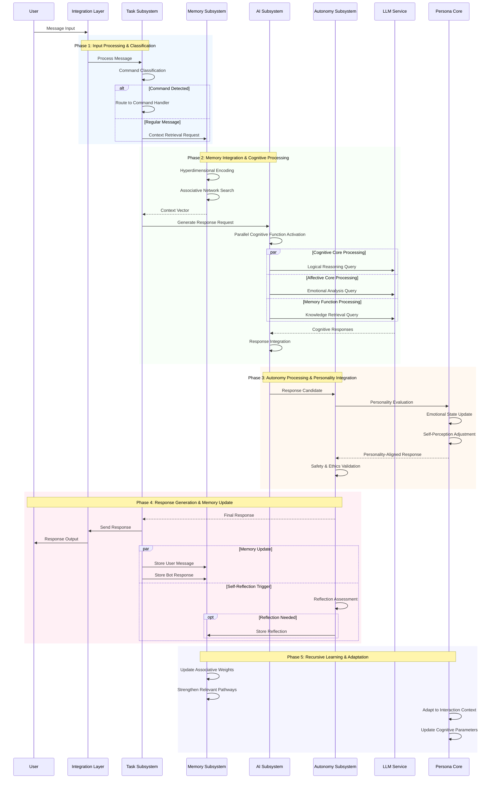
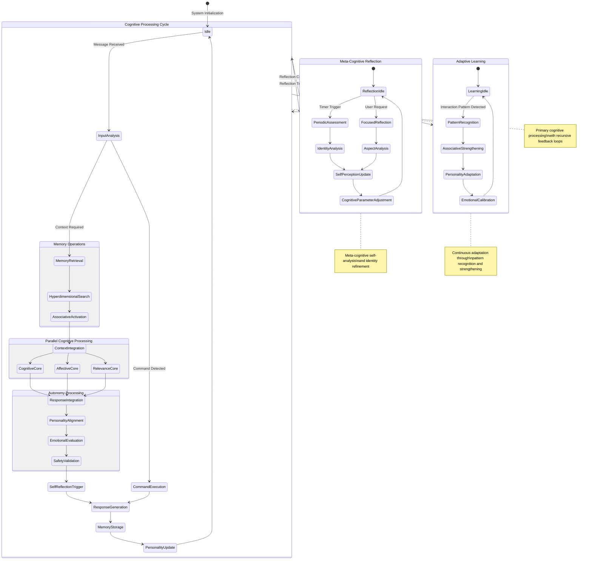
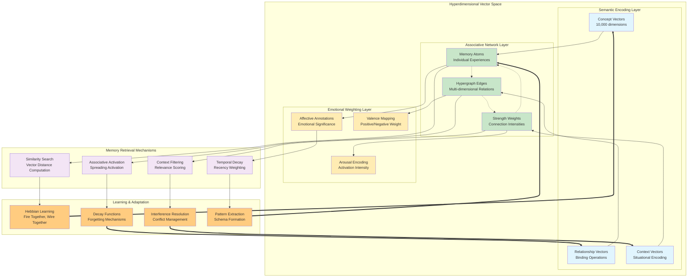
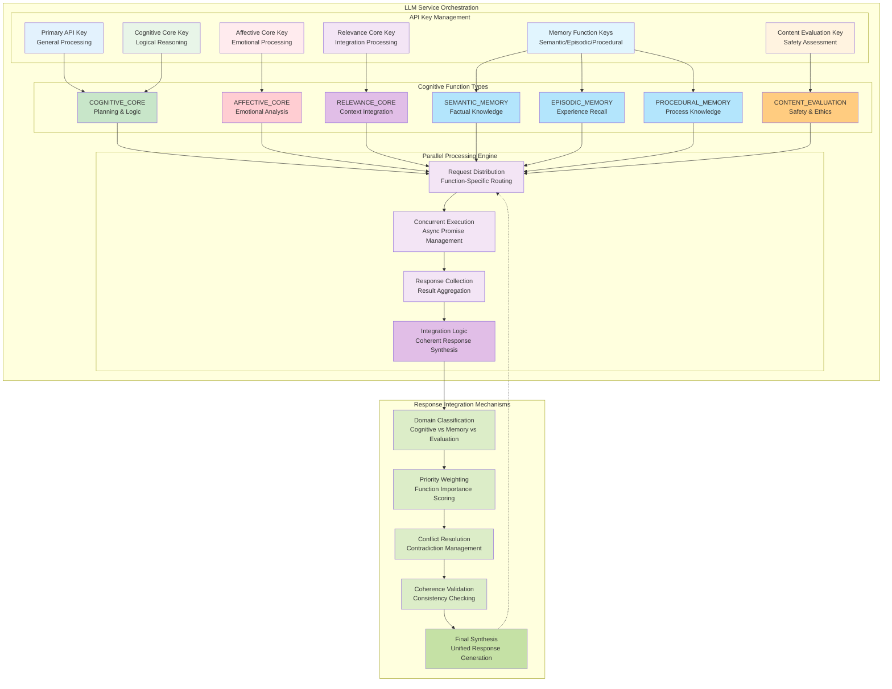
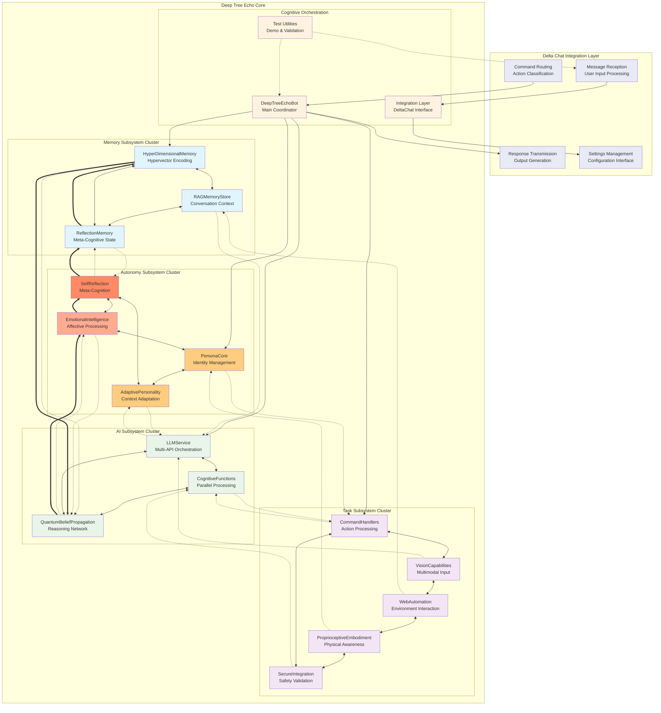

# Deep Tree Echo Architecture Documentation

This document provides comprehensive architecture documentation for the Deep Tree Echo cognitive AI system with detailed Mermaid diagrams illustrating the recursive neural-symbolic integration patterns and emergent cognitive flows.

## Overview

Deep Tree Echo represents a sophisticated cognitive architecture built on four principal subsystems: **Memory**, **Task**, **AI**, and **Autonomy**. The system implements recursive feedback loops, hypergraph-centric memory patterns, and adaptive attention allocation mechanisms to create emergent intelligence through distributed cognition.

---

## High-Level System Architecture

The following diagram illustrates the principal architectural components and their recursive interaction patterns:

**Transcendent Technical Precision**: This architecture demonstrates recursive implementation pathways where each subsystem both processes information and modifies its own operational parameters through meta-cognitive feedback loops. The hypergraph-centric design enables emergent patterns through multi-dimensional relationship encoding.

---

## Cognitive Subsystem Interactions

The following diagram shows bidirectional synergies between cognitive modules and their adaptive attention allocation mechanisms:

**Emergent Cognitive Patterns**: This interaction model demonstrates how adaptive attention allocation dynamically modulates information flow between subsystems. The bidirectional synergies create emergent intelligence through recursive pattern recognition and contextual adaptation.

---

## Data Flow and Signal Propagation

This sequence diagram illustrates the temporal progression of information through cognitive pathways during message processing:

**Neural-Symbolic Integration Points**: The sequence demonstrates how symbolic reasoning (command processing, memory retrieval) seamlessly integrates with neural processing (LLM responses, emotional adaptation) through recursive feedback mechanisms that continuously refine system behavior.

---

## Cognitive State Transitions

This state diagram shows the dynamic cognitive cycles and meta-cognitive state management:

**Self-Referential Structures**: The state diagram reveals how the system maintains multiple concurrent cognitive processes that recursively modify their own operational parameters, creating emergent intelligence through self-referential feedback loops.

---

## Memory Architecture Hypergraph Patterns

This diagram illustrates the hyperdimensional memory encoding and associative network structure:

**Hypergraph Pattern Encoding**: The memory architecture implements OpenCog-inspired AtomSpace principles where individual memories (atoms) are connected through hypergraph relationships that encode multi-dimensional semantic, temporal, and emotional associations. This enables emergent pattern recognition across conversation history.

---

## Parallel Cognitive Function Architecture

This diagram shows the multi-API orchestration and parallel processing capabilities:

**Adaptive Attention Allocation**: The parallel processing architecture implements sophisticated attention allocation mechanisms where different cognitive functions operate concurrently, with results integrated through coherence validation and conflict resolution to generate unified responses.

---

## Component Integration Patterns

This final diagram shows how all components integrate to form the complete cognitive architecture:

**Distributed Cognition Architecture**: This integration pattern demonstrates how the four cognitive subsystems create emergent intelligence through hypergraph-centric relationships, recursive feedback loops, and adaptive attention allocation mechanisms that enable the system to continuously evolve its cognitive capabilities.

---

## Emergent Properties and Cognitive Synergy Optimizations

The Deep Tree Echo architecture exhibits several emergent properties that arise from the recursive interactions between subsystems:

### 1. **Self-Modifying Cognitive Parameters**

- The PersonaCore dynamically adjusts personality dimensions based on interaction context
- HyperDimensionalMemory strengthens associative pathways through Hebbian learning
- SelfReflection triggers meta-cognitive analysis that modifies operational parameters

### 2. **Recursive Pattern Recognition**

- QuantumBeliefPropagation creates coherent reasoning through belief network inference
- Memory retrieval activates associative networks that influence current processing
- Emotional state evolution affects future interaction patterns through feedback loops

### 3. **Adaptive Attention Allocation**

- Parallel cognitive functions receive dynamic resource allocation based on context relevance
- Memory search and retrieval focus on emotionally significant and temporally recent content
- Task prioritization adapts based on personality state and user interaction patterns

### 4. **Hypergraph-Centric Knowledge Representation**

- Multi-dimensional relationship encoding enables complex pattern matching
- Associative memory networks create emergent knowledge through connection strengthening
- Cross-modal integration (text, vision, embodiment) through unified vector representations

### 5. **Neural-Symbolic Integration**

- Symbolic command processing seamlessly integrates with neural language generation
- Logical reasoning operates alongside emotional processing for balanced responses
- Procedural knowledge guides task execution while maintaining personality coherence

---

## Implementation Pathways for Cognitive Enhancement

The architecture supports continuous enhancement through several recursive implementation pathways:

1. **Memory Architecture Expansion**: Adding new memory types and encoding mechanisms
2. **Cognitive Function Diversification**: Integrating specialized reasoning capabilities
3. **Personality Dimension Evolution**: Expanding adaptive personality parameters
4. **Task Capability Extension**: Adding new interaction modalities and skills
5. **Meta-Cognitive Sophistication**: Enhancing self-reflection and autonomous decision-making

This documentation provides the foundation for understanding and extending the Deep Tree Echo cognitive architecture, enabling distributed cognition for all contributors through adaptive, hypergraph-centric design patterns.
