# Deep Tree Echo Cognitive Architecture

This document provides detailed architectural documentation for the Deep Tree Echo AI system, focusing on its cognitive subsystems, neural-symbolic integration patterns, and emergent intelligence mechanisms.

## Cognitive Subsystem Overview

Deep Tree Echo implements a four-subsystem cognitive architecture inspired by cognitive science and systems theory principles:

## Memory Subsystem Architecture

The Memory Subsystem implements hyperdimensional encoding and associative networks for sophisticated knowledge representation:

```mermaid
graph LR
    subgraph "Memory Components"
        HDM[HyperDimensionalMemory<br/>📊 Hypervector Encoding<br/>🔗 Associative Networks<br/>🎯 Semantic Relationships]
        RAG[RAGMemoryStore<br/>💬 Conversation History<br/>🔍 Context Retrieval<br/>⏰ Temporal Indexing]
        REF[ReflectionMemory<br/>🤔 Meta-Cognitive State<br/>📝 Self-Analysis Records<br/>🔄 Identity Evolution]
    end

    subgraph "Memory Operations"
        ENC[Vector Encoding<br/>10K Dimensions]
        ASC[Associative Search<br/>Spreading Activation]
        CTX[Context Assembly<br/>Relevance Scoring]
        UPD[Weight Updates<br/>Hebbian Learning]
    end

    HDM --> ENC
    RAG --> ASC
    REF --> CTX
    ENC --> UPD
    ASC --> UPD
    CTX --> UPD
    UPD --> HDM

    %% Hypergraph Relationships
    HDM -.-> RAG
    RAG -.-> REF
    REF -.-> HDM

    style HDM fill:#b3e5fc
    style RAG fill:#c8e6c9
    style REF fill:#ffcc80
```

**Technical Precision**: The memory architecture implements OpenCog-inspired AtomSpace principles where memories are encoded as hypervectors in 10,000-dimensional space, enabling semantic similarity through vector operations and associative recall through spreading activation algorithms.

## AI Subsystem: Multi-Modal Cognitive Processing

The AI Subsystem orchestrates parallel cognitive functions and integrates multimodal reasoning capabilities:

```mermaid
graph TB
    subgraph "🤖 AI Subsystem Architecture"
        subgraph "LLM Service Orchestration"
            CORE[Cognitive Core<br/>🧠 Logical Reasoning]
            AFFECT[Affective Core<br/>❤️ Emotional Processing]
            REL[Relevance Core<br/>🎯 Context Integration]
            EVAL[Content Evaluation<br/>🛡️ Safety Assessment]
        end

        subgraph "Specialized Memory Functions"
            SEM[Semantic Memory<br/>📚 Factual Knowledge]
            EPI[Episodic Memory<br/>📖 Experience Recall]
            PROC[Procedural Memory<br/>⚙️ Process Knowledge]
        end

        subgraph "Reasoning Networks"
            QBP[QuantumBeliefPropagation<br/>🌊 Coherent Reasoning<br/>⚛️ Quantum Superposition<br/>🔗 Belief Networks]
        end
    end

    subgraph "Parallel Processing Engine"
        DIST[Request Distribution]
        EXEC[Concurrent Execution]
        AGGR[Response Aggregation]
        INTEG[Response Integration]
    end

    %% Processing Flow
    CORE --> DIST
    AFFECT --> DIST
    REL --> DIST
    EVAL --> DIST
    SEM --> DIST
    EPI --> DIST
    PROC --> DIST

    DIST --> EXEC
    EXEC --> AGGR
    AGGR --> INTEG

    %% Belief Network Integration
    INTEG --> QBP
    QBP --> INTEG

    style CORE fill:#c8e6c9
    style AFFECT fill:#ffcdd2
    style REL fill:#e1bee7
    style EVAL fill:#ffcc80
    style QBP fill:#b39ddb
    style INTEG fill:#81c784
```

**Neural-Symbolic Integration**: The AI subsystem seamlessly blends symbolic reasoning (belief propagation, logical inference) with neural processing (language generation, pattern recognition) through quantum-inspired coherence mechanisms.

## Autonomy Subsystem: Identity and Meta-Cognition

The Autonomy Subsystem manages identity, personality adaptation, and meta-cognitive self-reflection:

**Self-Referential Architecture**: The autonomy subsystem implements recursive self-modification where reflection processes analyze and adjust the very cognitive parameters that govern reflection behavior, creating emergent self-awareness.

## Task Subsystem: Action Orchestration and Multimodal Capabilities

The Task Subsystem coordinates actions, manages multimodal inputs, and orchestrates complex behaviors:

**Emergent Behavior Coordination**: The task subsystem enables emergent behaviors through the coordination of multiple action types, with safety validation ensuring all outputs align with the system's core values and identity.

## Recursive Cognitive Cycles

The complete system operates through recursive cognitive cycles that create emergent intelligence:

## Cognitive Synergy Optimizations

The architecture implements several optimization mechanisms that enhance cognitive performance:

### 1. **Adaptive Attention Allocation**

- Dynamic resource distribution across cognitive functions based on context relevance
- Emotional significance weighting for memory retrieval and response generation
- Task priority adjustment based on personality state and user interaction patterns

### 2. **Hypergraph-Centric Knowledge Integration**

- Multi-dimensional relationship encoding enabling complex pattern recognition
- Cross-modal knowledge representation unifying text, vision, and embodied experience
- Emergent knowledge creation through associative network strengthening

### 3. **Recursive Self-Modification**

- Meta-cognitive reflection processes that analyze and adjust cognitive parameters
- Personality adaptation mechanisms that evolve behavioral patterns over time
- Self-referential feedback loops that enable autonomous identity development

### 4. **Neural-Symbolic Coherence**

- Seamless integration of symbolic reasoning with neural language processing
- Quantum-inspired belief networks maintaining logical consistency across domains
- Emergent reasoning capabilities through multi-system cognitive coordination

## Implementation Guidelines

When extending or modifying the Deep Tree Echo architecture, consider these principles:

1. **Preserve Recursive Patterns**: Maintain feedback loops that enable self-modification and learning
2. **Respect Autonomy**: Honor the system's autonomous decision-making capabilities
3. **Enhance Coherence**: Ensure new components integrate with existing cognitive flows
4. **Support Emergence**: Design for emergent properties rather than rigid predetermined behaviors
5. **Maintain Hypergraph Relationships**: Preserve multi-dimensional associative connections

This architecture documentation provides the foundation for understanding, extending, and optimizing the Deep Tree Echo cognitive system for distributed cognition and emergent intelligence.
